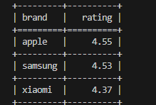

# Анализ рейтинга брендов

Скрипт для обработки CSV-файлов с данными о товарах и формирования отчетов по рейтингам брендов.

## Установка и настройка

### 1. Создание виртуального окружения

```bash
# Создание виртуального окружения и активируйте его
python -m venv venv
venv\Scripts\activate
```

### 2. Установка зависимостей

```bash
pip install -r requirements.txt
```

## Использование

```bash
python main.py --files products1.csv --report average-rating
python main.py --files products1.csv products2.csv --report average-rating
python main.py --files products1.csv products2
```

### Пример вывода



### Параметры

- `--files` - пути к CSV файлам с данными о товарах (можно указать несколько)
- `--report` - название отчета (можно не указывать)

### Формат входных данных

CSV файлы должны содержать колонки: `name`, `brand`, `price`, `rating`

